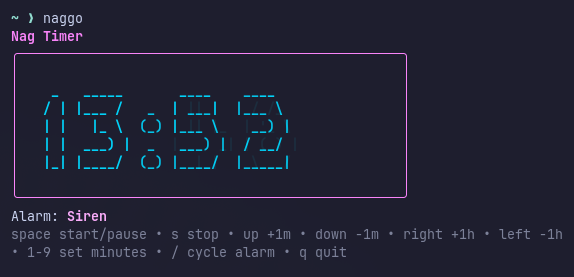

# naggo



`naggo` is a tiny terminal UI timer that politely nags you until you acknowledge it. Set an interval, keep working, and let the animated ASCII countdown plus configurable alarm sounds do the rest.

## Requirements

- Go 1.22+ (module tested with Go 1.25)
- A terminal that supports ANSI colours (most do)

Sound playback uses built-in synthesized tones, so no external assets or players are required.

## Install

```bash
go install github.com/ciryon/naggo@latest
```

Sound works out of the box—`naggo` uses pure-Go waveforms, so you do **not** need ALSA or CoreAudio headers when installing or running.

This drops a `naggo` binary into your `$GOBIN` (default: `$GOPATH/bin`). Make sure that directory is on your `$PATH`, then launch with:

```bash
naggo
```

## Build From Source

```bash
git clone https://github.com/ciryon/naggo.git
cd naggo
go build -o naggo
./naggo
```

To cross-compile for another platform:

```bash
GOOS=darwin GOARCH=arm64 CGO_ENABLED=0 go build -ldflags="-s -w" -o dist/naggo-darwin-arm64
```

Repeat with the desired `GOOS`/`GOARCH` pairs (e.g. `linux/amd64`, `linux/arm64`) before uploading release artifacts. Keeping `CGO_ENABLED=0` ensures the build stays portable on Linux and macOS without extra native dependencies.

## Releasing on GitHub

1. Update the changelog (if any) and bump version in your tag name, for example:

   ```bash
   git tag -a v0.1.0 -m "v0.1.0"
   git push origin v0.1.0
   ```

2. Build binaries for the platforms you want to support (see cross-compile snippet above, or use the provided GitHub Actions workflow) and attach them to the GitHub release.
3. Users can either download those archives or run `go install github.com/ciryon/naggo@latest`.

## Controls

- `space` start/pause
- `s` stop (silence nag)
- `up/down` ±1 minute (the last minute counts down in 1‑second steps)
- `right/left` ±1 hour
- `1`–`9` set timer to N minutes
- `/` cycle alarm sound
- `q` quit

Enjoy the nag. 😄

## Acknowledgements

Thank you to Eletric Pocket Ltd for inspiration and many nags.
